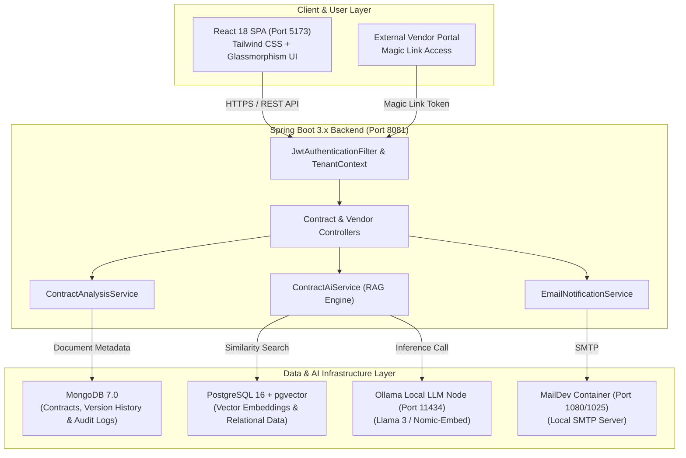

# ContractIQ 📜🤖
### AI-Enhanced B2B Contract Management & Risk Analysis SaaS

> **Enterprise-grade B2B Contract Lifecycle & Risk Analysis SaaS powered by local RAG, automated risk scoring, and secure vendor collaboration.**


---

## 📌 High-Level Executive Overview

**ContractIQ** is a production-ready, full-stack B2B SaaS platform designed to automate contract risk evaluation, accelerate vendor negotiations, and maintain immutable audit records. By pairing **Spring Boot 3.x** and **React 18** with a **local RAG AI pipeline (Ollama + pgvector)**, ContractIQ enables corporate legal and procurement teams to analyze multi-page legal PDFs in seconds — with **zero external AI API costs** and **100% data privacy**.

### Core Architecture Highlights
* **Zero Third-Party AI Lock-In**: Powered by locally hosted LLMs (`llama3`) via Ollama and `pgvector` hybrid similarity search.
* **Dual-Database Storage Model**: Structured relational data & tenant configuration stored in **PostgreSQL**, while unstructured document metadata, version histories, and immutable activity feeds live in **MongoDB**.
* **Zero-Trust Multi-Tenancy**: Workspace-isolated JWT context scoping across all REST APIs, vector queries, and document repositories.
* **External Negotiation Gateway**: Unauthenticated, cryptographically signed **Magic Portal Links** allowing external vendors to review version counter-offers, submit public replies, and upload revised PDF copies safely.

---

## 🛠️ Core Technology Stack

| Layer | Technologies & Tools | Key Role & Application |
|---|---|---|
| **Backend Framework** | Java 17, Spring Boot 3.x, Spring Data JPA, Spring Security | Enterprise REST API, JWT auth, tenant context ThreadLocals, security rules |
| **AI & Vector Engine** | Spring AI, Ollama (`llama3`), `pgvector` | Local RAG context retrieval, legal clause vectorization, plain-English Q&A |
| **Frontend UI** | React 18, TypeScript, Tailwind CSS, Lucide Icons | Responsive Glassmorphism interface, interactive PDF viewer, AI Chat studio |
| **Relational Database** | PostgreSQL 16 (`pgvector` extension) | Vector embeddings, relational tenant mappings, and structured indexes |
| **Document Database** | MongoDB 7.0 | Contract versions, audit trails, and internal vs. public collaboration notes |
| **Email & Testing** | MailDev (Local SMTP Container) | Automated email notification pipeline for uploads, comments, and counter-offers |
| **DevOps & Tooling** | Docker, Docker Compose, Maven | Containerized database stack, reproducible builds, and seamless orchestration |

---

## 🚀 Key System Features

### 1. 🤖 Automated Risk Scoring Engine
* Ingests contract PDF uploads via `PdfParsingService` and extracts raw textual blocks.
* Analyzes compliance against standard legal playbooks (GDPR data privacy, liability limits, indemnification boundaries, governing law).
* Color-codes overall risk indexes (**HIGH / MEDIUM / LOW**) and displays an interactive gauge alongside clause-by-clause mitigation suggestions.

### 2. 💬 Local RAG AI Chat (Review Studio)
* Interactive, context-grounded AI assistant embedded directly inside the contract Review Studio.
* Performs similarity searches across PostgreSQL `pgvector` embeddings to pull top matching contract chunks.
* Strictly enforces plain-English, non-markdown single-paragraph responses per enterprise formatting standards (`RAG_SYSTEM_PROMPT`).

### 3. 🔐 Multi-Tenant Vendor Negotiation (Magic Links)
* Generates time-bounded, cryptographically signed vendor collaboration URLs.
* Enables external vendor contacts to review contract versions, post public notes, and upload counter-offer PDFs **without creating user account credentials**.
* Automatically creates next-generation version iterations (`v2`, `v3`) upon vendor counter-offer uploads.

### 4. 🔒 Internal vs. Public Privacy & Audit Trail
* Implements dual-channel collaboration notes: **Internal Strategy** (visible only to workspace employees) vs. **Vendor Facing** (shared with external counterparties).
* Immutably logs every upload, status change, comment posting, and magic link generation in MongoDB audit collections.

### 5. 📧 Automated Notification Pipeline
* Integrates Spring Boot Mail sender with a local **MailDev** SMTP container (`http://localhost:1080`).
* Triggers HTML email notifications for contract uploads, vendor counter-offers, team invitations, and status changes.

### 6. 📦 Archival & Compliance Workflow
* Manages contract lifecycle transitions: `DRAFT` ➔ `UNDER_REVIEW` ➔ `APPROVED` ➔ `ACTIVE` ➔ `ARCHIVED`.
* **Read-Only Mode**: When archived, contract comment submission and vendor magic link generation are locked, while PDF previews, AI risk scores, and AI Chat remain active.
* Preserves all MongoDB audit histories, PostgreSQL vector search embeddings, and stored PDF files permanently.

---

## 📐 System Architecture Diagram



---

## 💻 Local Setup & Installation Guide

### 1. Prerequisites
Ensure you have the following installed on your developer machine:
* **Java Development Kit (JDK 17+)**
* **Node.js (v18+) & npm**
* **Docker & Docker Desktop**
* **Ollama** (optional for local LLM inference; fallback semantic engine active by default)

---

### 2. Step-by-Step Terminal Commands

#### Step A: Clone Repository & Start Infrastructure Services
```bash
# Clone the repository
git clone https://github.com/Spurthi-019/AI-Enhanced-B2B-Contract-Management-Risk-Analysis-SaaS.git
cd AI-Enhanced-B2B-Contract-Management-Risk-Analysis-SaaS

# Start PostgreSQL (pgvector), MongoDB, and MailDev containers
docker-compose up -d
```

#### Step B: Launch Local Ollama Model (Optional for local LLMs)
```bash
# Serve Ollama and pull llama3 model
ollama serve
ollama pull llama3
```

#### Step C: Build & Start Spring Boot Backend
```bash
cd backend

# Compile and start backend server (runs on http://localhost:8081)
.\mvnw.cmd spring-boot:run
```

#### Step D: Install & Start React Frontend
```bash
cd ../frontend

# Install dependencies and start Vite dev server (runs on http://localhost:5173)
npm install
npm run dev
```

---

## 🔑 Environment Variables Reference

| Variable Name | Default Value | Purpose / Description |
|---|---|---|
| `SPRING_DATASOURCE_URL` | `jdbc:postgresql://localhost:5432/contractiq` | Relational & vector database connection string |
| `SPRING_DATASOURCE_USERNAME` | `postgres` | PostgreSQL superuser username |
| `SPRING_DATASOURCE_PASSWORD` | `postgres` | PostgreSQL database password |
| `SPRING_DATA_MONGODB_URI` | `mongodb://localhost:27017/contractiq` | MongoDB document store URI |
| `SPRING_AI_OLLAMA_BASE_URL` | `http://localhost:11434` | Ollama local API base endpoint |
| `SPRING_AI_OLLAMA_CHAT_MODEL` | `llama3` | Default local LLM model name |
| `SPRING_MAIL_HOST` | `localhost` | MailDev SMTP server hostname |
| `SPRING_MAIL_PORT` | `1025` | MailDev SMTP server port |
| `JWT_SECRET` | `your_secure_base64_jwt_signing_key_here_must_be_at_least_256_bits` | HMAC-SHA256 JWT signing secret key |

---

## 📑 Key REST API Endpoints

| Method | Endpoint Path | Description | Access Level |
|---|---|---|---|
| `POST` | `/api/v1/auth/login` | Authenticate user & issue JWT bearer token | Public |
| `GET` | `/api/v1/contracts` | Fetch tenant contracts (filters archived by default) | Authenticated |
| `POST` | `/api/v1/contracts/upload` | Upload PDF agreement & trigger vector indexing | Authenticated |
| `GET` | `/api/v1/contracts/{id}/download` | Stream PDF file preview for embedded viewer | Authenticated |
| `POST` | `/api/v1/contracts/{id}/analyze` | Trigger automated RAG risk evaluation | Authenticated |
| `PATCH/PUT` | `/api/v1/contracts/{id}/status` | Update contract lifecycle status (`ARCHIVED`, `APPROVED`, etc.) | Authenticated |
| `POST` | `/api/ai/chat` | Ask grounded natural-language questions (RAG AI Chat) | Authenticated |
| `POST` | `/api/v1/vendor/portal/magic-link` | Generate secure external vendor collaboration link | Authenticated |
| `GET` | `/api/v1/vendor/portal/access` | Validate vendor magic link token & fetch contract view | Vendor Public |
| `POST` | `/api/v1/vendor/portal/upload` | Vendor counter-offer PDF upload (creates new version) | Vendor Public |

---

## 🌟 Resume & Recruiter Technical Highlights

> **Technical Highlights for Engineering Managers & Technical Recruiters:**

1. **Zero Third-Party AI API Overhead**: Engineered an enterprise RAG pipeline using local **Ollama (`llama3`)** and **PostgreSQL `pgvector`**, keeping confidential legal contracts 100% on-premise while eliminating cloud API consumption costs.
2. **Dual-Database Architectural Design**: Combined **PostgreSQL** for relational schema consistency & vector embeddings with **MongoDB** for high-throughput, unstructured audit logs and multi-version document histories.
3. **Stateless Multi-Tenancy & Zero-Trust Security**: Designed ThreadLocal-based `TenantContext` propagation in Spring Security filters, ensuring zero cross-tenant data leakage across REST queries, vector searches, and file storage.
4. **Token-Gated Vendor Gateway**: Built an unauthenticated external negotiation workflow using cryptographically signed JWT tokens, allowing counterparty collaboration without bloating workspace user seats.

---

## 📜 License & Author

* **Author**: Spurthi ([@Spurthi-019](https://github.com/Spurthi-019))
* **Repository**: [AI-Enhanced-B2B-Contract-Management-Risk-Analysis-SaaS](https://github.com/Spurthi-019/AI-Enhanced-B2B-Contract-Management-Risk-Analysis-SaaS)
* **License**: MIT License
